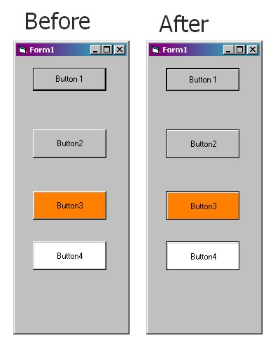



## A function to make flat buttons in pure VB\.

### Description

A function to make CommandButtons flat. Easy. No API's, OCXes etc. Just pure VB.
 
### More Info
 

             |
---                |---
**Submitted On**   |2002-08-24 13:24:50
**By**             |[Janekk](https://github.com/Planet-Source-Code/PSCIndex/blob/master/ByAuthor/janekk.md)
**Level**          |Intermediate
**User Rating**    |4.3 (26 globes from 6 users)
**Compatibility**  |VB 4\.0 \(16\-bit\), VB 4\.0 \(32\-bit\), VB 5\.0, VB 6\.0, VBA MS Access, VBA MS Excel
**Category**       |[Custom Controls/ Forms/  Menus](https://github.com/Planet-Source-Code/PSCIndex/blob/master/ByCategory/custom-controls-forms-menus__1-4.md)
**World**          |[Visual Basic](https://github.com/Planet-Source-Code/PSCIndex/blob/master/ByWorld/visual-basic.md)
**Archive File**   |[A\_function1219868242002\.zip](https://github.com/Planet-Source-Code/janekk-a-function-to-make-flat-buttons-in-pure-vb__1-38241/archive/master.zip)

